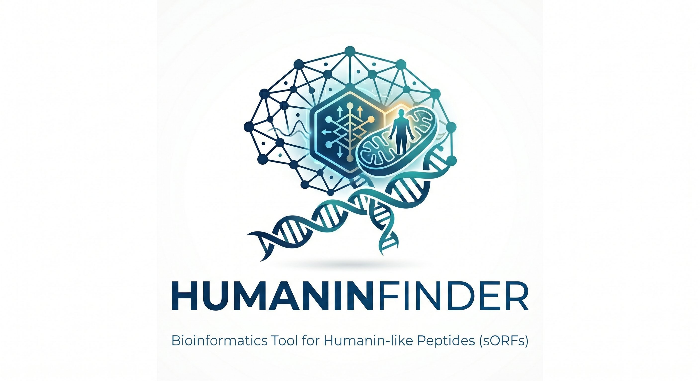

# HumaninFinder v1.0.6 🧬🤖

<p align="center">
  
</p>

<!-- Institutional Badges -->
[](https://doi.org/10.5281/zenodo.1220989570)
[](https://www.umc.br/)
[](https://github.com/LaBiOmicS)
[](https://github.com/LaBiOmicS/humanin-finder)

<!-- Open Science Badges -->
[](https://pypi.org/project/humaninfinder/)
[](https://github.com/LaBiOmicS/humanin-finder)
[](https://github.com/LaBiOmicS/humanin-finder)
[](https://opensource.org/licenses/MIT)
[](https://joss.theoj.org/)
[](https://github.com/LaBiOmicS/humanin-finder/actions/workflows/ci.yml)

<!-- Tech & Method Badges -->
[](https://www.python.org/)
[](https://ollama.com)
[](https://github.com/LaBiOmicS/humanin-finder)

---

`HumaninFinder` is a professional, high-performance Python framework designed for the discovery and classification of Humanin-like peptides (sORFs) within mitochondrial genomes. It employs a **Hybrid AI Engine** that integrates deep structural embeddings from the ESM-2 Protein Language Model with explicit biophysical analysis to identify functional, non-canonical, and pseudogenic sequences across any taxonomic group.

---

## 📂 Repository Structure

```text
.
├── conda/                   # Bioconda recipe and metadata
├── deploy/                  # Containerization (Dockerfile, Singularity.def)
├── docs/                    # Technical documentation and user guides
├── examples/                # Quick-start samples (FASTA genomes)
├── galaxy/                  # Galaxy Tool wrapper and integration
├── paper/                   # Publication manuscripts
│   ├── joss/                # Software description for JOSS
│   └── primate_study/       # Scientific case study on 61 primate genomes
├── src/
│   └── humaninfinder/       # Main Python Package
│       ├── cli.py           # Subcommand-based Command-line interface
│       ├── core.py          # Locus localization and ORF finding logic
│       ├── classifier.py    # Hybrid AI Engine (ESM-2 + Biophysical)
│       ├── agent.py         # AI Research Agent (Ollama integration)
│       ├── data/            # HMM models and 16S probes
│       └── models/          # Pre-trained hybrid classifier weights
├── tests/                   # Unit and biological validation tests
├── pyproject.toml           # Build system and PyPI definitions
└── pixi.toml                # Modern environment management
```

### 🧩 Core Components Detail

- **`Hybrid AI Engine`**: Combines mean-pooled embeddings from the ESM-2 transformer model (`esm2_t6_8M_UR50D`) with charge, pI, and hydrophobicity metrics.
- **`Evolutionary Rescue`**: A high-sensitivity sliding-window scanner that "rescues" non-canonical and pseudogenic relics in diverged lineages.
- **`AI Research Agent`**: An integrated specialist assistant powered by local LLMs (via **Ollama**) to provide biological interpretation of results in the context of mitochondrial aging and cytoprotection.
- **`Biological Deduplication`**: A specialized filter that ensures independent evolutionary signals by removing technical windowing artifacts.

---

## 🚀 Key Features

- **Organism Agnostic:** Supports all 33 NCBI genetic codes, enabling MDP discovery in any mitochondria-bearing taxon.
- **Expert AI Agent:** Built-in specialist in Humanin, mitochondrial signaling, and aging biology to interpret your findings.
- **High-Throughput Ready:** Parallelized processing and optimized inference for large genomic collections.
- **Validated Science:** Built-in reproduction of the 61-primate evolutionary case study.

---

## 🛠️ Quick Start

### 1. Installation

#### Option A: via `pip` (Fastest)
```bash
pip install "humaninfinder[agent]"
humanin-finder setup
```
*Note: Ensure [HMMER3](http://hmmer.org/) is installed on your system.*

#### Option B: via `Conda` / `Mamba` (Recommended)
Perfect for an isolated scientific environment:

```bash
# Create environment from the provided file
mamba env create -f environment.yml
mamba activate humanin_env

# Finalize setup
humanin-finder setup
```

### 2. Run Discovery Pipeline
```bash
humanin-finder predict -i genome.fasta -o results --hmm --rescue
```

### 3. Biological Interpretation
```bash
# Get a summary of your findings from the AI Specialist
humanin-finder agent --results results_results.csv
```

---

## 📖 Documentation
Detailed information is available in the **[paper/](paper/)** directory:
- 🛠️ **[Software Paper](paper/joss/paper.md)**: Architecture and methodology for JOSS.
- 🏗️ **[Scientific Report](paper/primate_study/evolutionary_analysis_report.md)**: Evolutionary dynamics of Humanin in Primates.

---

## 🤝 Contributing
Contributions are welcome! Please see our [CONTRIBUTING.md](CONTRIBUTING.md) for details.

## 📄 License
This project is licensed under the MIT License - see the [LICENSE](LICENSE) file for details.

---
**Developed by [LaBiOmicS](https://github.com/LaBiOmicS)** - *Laboratory of Bioinformatics and Omics Sciences.*
**Institution:** [Universidade de Mogi das Cruzes (UMC)](https://www.umc.br/)
